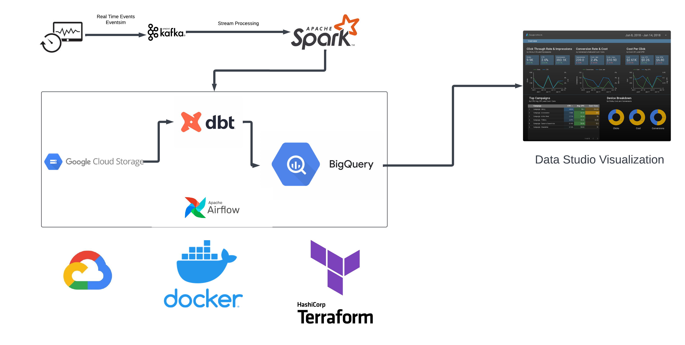

# liveBeats

I have always been an ardent lover of the cloud and Apache Airflow (even before Data Engneering was a thing!)

In this project I delve into GCP and Data Engineering (yet again) to bring to you LiveBeats!
 
This is my attempt at generating an end to end data pipeline using Apache Kafka, Apache Spark Streaming, dbt, Docker, Airflow, Terraform and GCP to visualize real time streaming music data.

## Architecture

- Dataset:
    1. [Eventsim](http://millionsongdataset.com/pages/getting-dataset/#subset)
- Tools & Technologies
    1. Cloud - Google Cloud Platform
    2. Infrastructure as Code software - Terraform
    3. Containerization - Docker, Docker Compose
    4. Stream Processing - Kafka, Spark Streaming
    5. Orchestration - Airflow
    6. Transformation - dbt
    7. Data Lake - Google Cloud Storage
    8. Data Warehouse - BigQuery
    9. Data Visualization - Data Studio